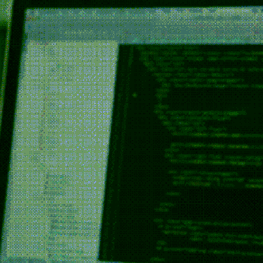

## ➕ Sobre mim:
- Tenho 15 anos;
- Também sou um noob em photoshop;
- Entrei nesse universo do desenvolvimento web e da programação por curiosidade e pela possibilidade de criar diversas coisas e soluções;
- Sempre aprimorando meus conhecimentos. 

## ⚙ Estatísticas 

## 💬 A quote 

> “The programmers of tomorrow are the wizards of the future” 
>> -Gabe Newell  
